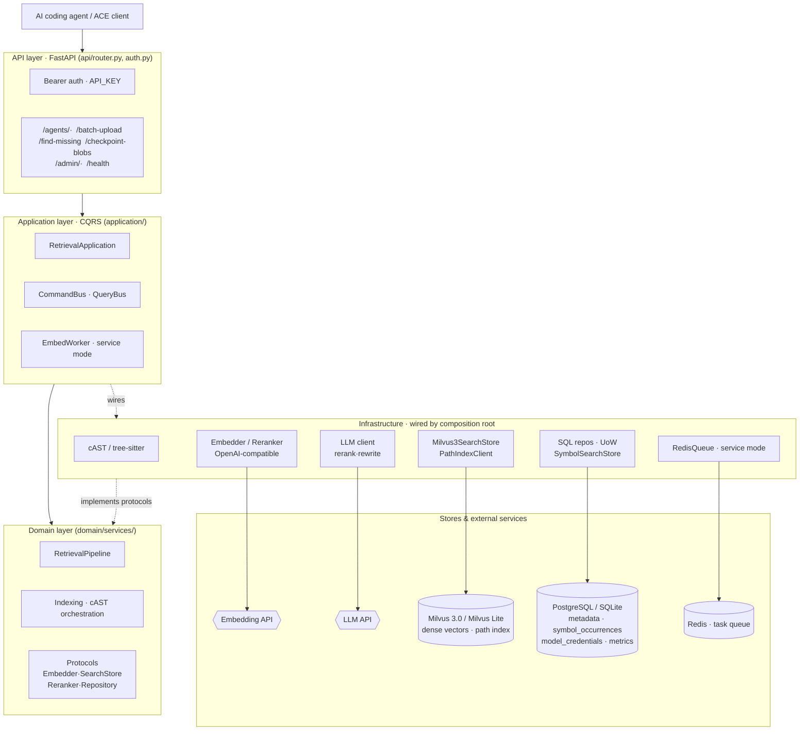
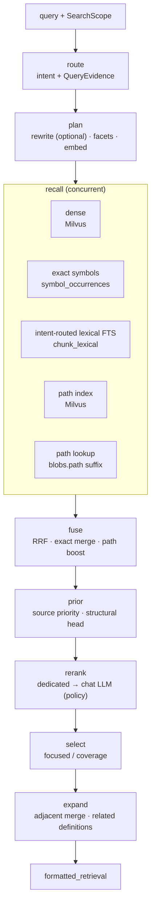

<div align="center">


# OpenContextEngine

**Self-hosted, ACE-compatible code retrieval for AI coding agents.**

Hybrid dense + exact + path recall · cAST-aware chunking · optional reranking · task-aware selection

[English](README.md) · [简体中文](README.zh-CN.md)

[](https://github.com/JasonEX/oce/actions/workflows/ci.yml)
[](LICENSE)
[](https://github.com/JasonEX/oce/pkgs/container/oce)
[](https://fastapi.tiangolo.com/)
[](https://milvus.io/)
[](#api)

</div>

OpenContextEngine is a self-hosted, ACE-compatible code retrieval service. It indexes
source files with cAST-aware chunking, stores metadata in PostgreSQL or SQLite, performs
dense vector retrieval in Milvus 3.0, and can apply a dedicated rerank API or chat LLM
before task-aware context selection.

It ships two deployment modes: a zero-dependency **personal mode** (SQLite + embedded
Milvus Lite, background worker disabled) for a single machine, and a **service mode**
(PostgreSQL + Milvus 3.0 + Redis) for shared, higher-throughput deployments.

The project is fully open source, with the server and client maintained separately:

- Server: <https://github.com/JasonEX/oce>
- Client: <https://github.com/oce-ai/oce-client>

This is the refactored successor to the earlier ACE service. See the original
[linux.do discussion](https://linux.do/t/topic/2308140/125) for background.

Use personal mode when an AI coding tool only needs code context from your local machine.
Deploy service mode, together with `opencontextengine-client`, when multiple users or
machines need to share one index.

## Features

- **Hybrid retrieval** — concurrent dense semantic recall (Milvus 3.0), exact identifier lookup (`symbol_occurrences`), and an independent path index, fused with weighted rank fusion.
- **cAST-aware chunking** — tree-sitter parsing splits source along semantic boundaries instead of blind line windows.
- **Composable reranking + task-aware selection** — a dedicated reranker can provide low-latency relevance ordering, while a chat LLM can compare implementation semantics globally. Either may run alone or as an ordered cascade. Both preserve their input candidate set; configured recall filtering and the final focused/coverage selector own pruning.
- **Two deployment modes** — zero-dependency personal mode (SQLite + embedded Milvus Lite) for a single machine, or service mode (PostgreSQL + Milvus 3.0 + Redis) for shared, higher-throughput use.
- **ACE-compatible API** — a drop-in `/agents/*` surface for ACE clients, secured with bearer auth.
- **Clean DDD/CQRS architecture** — dependencies point inward; infrastructure is wired only by the composition root, keeping business logic testable.
- **Operational admin API + monitoring** — an admin-key-scoped surface manages model credentials, the embedding queue, and garbage collection, while a bypass metrics pipeline records call/token/resource stats and per-stage retrieval audits.
- **[Source-pinned issue-resolution evaluation](benchmarks/README.md)** — production APIs and the real client checkpoint/retrieval path run SWE-bench Verified issues against their base commits, scoring gold edit locations separately from successful SWE-Explore trajectory context, along with latency, returned context, model usage, and failures.

<details>
<summary><strong>Table of contents</strong></summary>

- [Features](#features)
- [Requirements](#requirements)
- [Personal mode](#personal-mode)
- [Service mode](#service-mode)
- [Client and MCP](#client-and-mcp)
- [API](#api)
- [Architecture](#architecture)
  - [Retrieval pipeline](#retrieval-pipeline)
- [Tests](#tests)
- [License](#license)

</details>

## Requirements

- Python 3.11 or newer
- [uv](https://docs.astral.sh/uv/)

Personal mode needs nothing else: metadata lives in SQLite and vectors in an embedded
Milvus Lite file. Service mode additionally requires PostgreSQL 16, Milvus 3.0, and
Redis; its development stack is defined in `docker-compose.dev.yml`.

## Personal mode

Personal mode is intended for local use and does not require separate PostgreSQL, Milvus,
or Redis services. Install the CLI, generate a config, set the embedding key, and serve:

```powershell
uv tool install "git+https://github.com/JasonEX/oce.git"
oce init                    # writes ~/.oce/data/.env
```

This fork does not publish to PyPI. Use a versioned GHCR image for releases, or install
the current source directly with `uv` as shown above.

Edit `~/.oce/data/.env`. The embedding service is the only required setting for indexing
and retrieval. The defaults use SiliconFlow and Qwen3-Embedding-4B (1024-dimensional
vectors):

```dotenv
EMBED_API_KEY=your_embedding_service_key
# These already have defaults; change them only when using another provider or model.
EMBED_ENDPOINT=https://api.siliconflow.cn/v1/embeddings
EMBED_MODEL=Qwen/Qwen3-Embedding-4B
```

Embedding sends admitted source chunks to the configured endpoint. Optional reranking and
LLM features send retrieval queries and candidate snippets as well. For private code, use
only endpoints approved to receive that data, preferably local or internal services.

The generated personal configuration keeps optional reranking disabled until you explicitly
authorize an endpoint to receive candidate snippets. A dedicated reranker offers predictable,
low-latency relevance ordering:

```dotenv
RERANK_ENABLED=true
RERANK_API_KEY=your_rerank_service_key
RERANK_ENDPOINT=https://provider.example.com/v1/rerank
RERANK_MODEL=Qwen/Qwen3-Reranker-0.6B
# Rank the full default candidate window; provider-omitted candidates still remain.
RERANK_TOP_N=50
# Bound the query repeated against every candidate; keeps the leading issue context.
RERANK_MAX_QUERY_CHARS=2400
# adaptive skips the call when exact symbol / path evidence already answers the query.
RETRIEVAL_RERANK_POLICY=adaptive
# Qwen reports typical gains from task instructions; clear this for unsupported providers.
# RERANK_INSTRUCTION=Given a code search query, judge whether the code snippet implements, defines, or directly answers what the query asks for
```

A strong chat LLM can instead, or subsequently, judge cross-language meaning, implementation
versus forwarding code, and multi-file behavior. For a bounded quality-first cascade, start
with a 20-candidate second stage and measure the model on your workload:

```dotenv
LLM_RERANK_ENABLED=true
LLM_API_KEY=your_llm_service_key
LLM_BASE_URL=https://provider.example.com/v1
LLM_MODEL=deepseek-v4-flash
RETRIEVAL_LLM_RERANK_POLICY=adaptive
LLM_MAX_CANDIDATES=20
LLM_RERANK_TIMEOUT_SECONDS=15
```

`RERANK_ENABLED` and `LLM_RERANK_ENABLED` are data-egress authorizations; the two
`*_POLICY` settings only decide which queries an authorized model sees, and both models share
one deterministic decision. `adaptive` skips a model when exact symbol/path evidence already
answers a focused lookup, keeps the chat LLM out of reference queries to preserve occurrence
coverage, and uses both for feature, flow, overview, and compound requests. `always` reranks
every result set with at least two candidates and is useful for quality-first deployments and
controlled comparisons. Each retrieval records its route (`dedicated`, `dedicated+llm`, or
`skip:<reason>`) in `retrieval_metrics.rerank_route`. Enabling
both backends forms a dedicated-reranker → chat-LLM cascade. The default-off posture is an
operational data/latency boundary, not a claim that chat-LLM ranking is lower quality.
The repeated development benchmark supports dedicated reranking as the first interactive
opt-in; the bounded chat cascade improved the small development set further but was too slow
for interactive use. This is still a 13-issue development observation, so authorization
defaults stay off until replicated on the full profile. See the
[benchmark report](benchmarks/results/swe-explore-development-2026-09-03.md). Candidates
outside either rerank window remain available to final selection.

Then start the service:

```powershell
oce serve                   # http://127.0.0.1:8986
```

Personal mode binds to `127.0.0.1` by default and pre-fills the client-compatible
`API_KEY=sk-opencontextengine`. If you expose the service on a LAN or the public internet,
replace it with a strong random key and set the same value in the client as `OCE_API_KEY`.

`oce serve` runs the database migrations (Alembic) on startup, then provisions SQLite,
the embedded Milvus Lite file, and a disabled background worker automatically, so
`oce init` only exposes the few keys you actually set. The generated `.env` lives in
the data directory and is loaded on every start. Useful flags:

- `--data-dir <path>` — where the database, vector file, and `.env` live (default `~/.oce/data`)
- `--env-file <path>` — load a specific `.env` instead (highest priority)
- `--port <n>` / `--host <addr>` — bind address (default `127.0.0.1:8986`)

`oce version` (or `oce --version`) prints the current version. `oce -v serve` raises the
log level to INFO and `-vv` to DEBUG; the default WARNING keeps retrieval-path info logs
quiet.

For a throwaway run without installing:
`uvx --from "git+https://github.com/JasonEX/oce.git" oce serve`.

## Service mode

Service mode is intended for multiple users or machines sharing one index. It is backed
by PostgreSQL, Milvus 3.0, and Redis. The repository's Docker Compose setup is the
recommended starting point:

```powershell
git clone https://github.com/JasonEX/oce.git
Set-Location oce
Copy-Item .env.example .env
# Edit .env: set API_KEY, ADMIN_API_KEY, and EMBED_API_KEY; add LLM_API_KEY as needed.
docker compose up -d
```

The root `docker-compose.yml` starts OCE, PostgreSQL, Redis, and the Milvus dependencies;
only the OCE API is published to the host, while Milvus remains on the internal Compose
network. The application container runs database migrations on startup. In service mode,
replace `API_KEY` and `ADMIN_API_KEY` with strong random values and set the
`POSTGRES_PASSWORD` and `REDIS_PASSWORD` values used by Compose. Never commit real
credentials. For development setups that start only the dependencies and run the app on
the host, use `docker-compose.dev.yml`; update `DB_URL` and `REDIS_URL` to its published
host ports before running `uv run alembic upgrade head` and `uv run uvicorn`.
The development file publishes PostgreSQL on `25432`, Redis on `26379`, and Milvus on
`19530` by default.

You can also use the published image directly:

```powershell
docker pull ghcr.io/jasonex/oce:latest
```

In your own Compose, Kubernetes, or other deployment, set the application image to
`ghcr.io/jasonex/oce:latest` and provide `DB_URL`, `REDIS_URL`, and `MILVUS_ENDPOINT`.
The image listens on port `8986` inside the container.

### Admin panel

After the service starts, use the official web panel at
<https://oce-ai.github.io/oce-admin>.

1. Set a dedicated `ADMIN_API_KEY` on the server (if unset, it falls back to `API_KEY`).
2. Enter the service URL and admin key in the panel.
3. Manage model credentials, the embedding queue, garbage collection, and monitoring
   metrics from the panel.

The admin key is stored only in the browser's local storage. Do not put it in a URL,
repository, or log. For a custom panel domain, configure its allowed origin with
`CORS_ORIGINS`.

Model clients resolve credentials from the single `model_credentials` table by `kind`
(`embed`, `rerank`, `llm_rerank`, `query_rewrite`): the active row with the
lowest `priority` number wins. When no active row matches a kind, that client falls back
to its environment variables (`EMBED_*`, `RERANK_*`, `LLM_*`; rerank also reuses the
embedding key). Manage these rows through the `/admin/credentials` API, then call
`POST /admin/credentials/reload` to hot-reload runtime credentials without restarting the
service. Embedding API keys, credential timeouts, and credential batching limits can be
reloaded in place. Changing the embedding endpoint, model, dimensions, or document input
window requires clean metadata and vector storage followed by a full client resync; an
incompatible hot reload is rejected.

On the first use of an empty index, OCE persists a secret-free SHA-256 profile covering the
resolved embedding endpoint hash, model, dimensions, query instruction hash, document
window, Milvus endpoint/collection identity, path-index mode, dense metric, chunker
mode/config/version, index schema, symbol extraction, and path-document versions. Every
startup compares the active configuration with that profile before workers start. A
mismatch—or legacy index data without a profile—fails closed and leaves the old data
untouched. Select a new data directory (or new database and Milvus collection names), then
fully resync clients. The service never silently combines old vectors with a new model,
connects ready metadata to a different vector collection, or reuses old chunks after
chunking behavior changes.

SiliconFlow accepts at most 32,000 characters across one embedding request's `input`
array. `max_batch_size` and `max_batch_chars` are provider defaults that each credential
may override. Inputs longer than `max_input_chars` are split at text boundaries with
overlap, embedded separately, then length-weighted, pooled, and normalized into one chunk
vector. This model-specific segmentation does not change domain chunk boundaries.

Repository-level requests containing multiple explicit sentences or list items are
decomposed into one complete query plus bounded facet queries. Each query recalls
candidates independently; results are fused with weighted rank fusion (configurable via
`RETRIEVAL_RRF_K`) before reranking. Single-query mode uses `RETRIEVAL_DEFAULT_TOP_K`;
multi-query mode uses `RETRIEVAL_PER_QUERY_TOP_K` per query to control candidate pool
size. Static source priors and the optional recall confidence floor run before either model,
so heterogeneous model and retrieval scores are never mixed for filtering and static order
cannot overwrite model ordering.
Both rerankers conserve candidates: they promote a ranked head and leave the remaining
retrieval order available to the final selector. With `adaptive` chat-LLM policy, exact symbol
and path evidence skip the model, reference queries retain occurrence coverage, and semantic
feature/flow/overview/compound requests use global snippet comparison. Final selection uses focused mode for symbol
and path lookups, preserving relevance order with a higher per-path cap, and coverage mode
for broader queries, first representing different files before filling remaining budget.
Both modes suppress overlapping spans; focused queries use a 12K character budget while
coverage queries retain the 32K repository-exploration budget. Disable
decomposition with `RETRIEVAL_QUERY_DECOMPOSITION_ENABLED=false` to revert to classic
single-query recall.

Exact identifier recall joins checkpoint membership directly, so large workspaces keep exact
recall without expanding every member into one SQL `IN (...)` clause. Added-only scopes and
unusually large request deltas use bounded batches; timeout still falls back to dense retrieval.
The symbol index is built by tree-sitter from whole files (definitions, endpoints, and
imports with real spans; a regex provider covers grammars the pack cannot load). It is not
a call or implementation graph. A lexical term index (SQLite FTS5 in personal mode,
PostgreSQL `tsvector` in service mode) recalls error strings, log text, and call sites that
dense vectors miss. It is routed to reference, call-chain, feature, overview, and compound requests;
symbol/path queries add it only when deterministic evidence is missing, while quoted or error-like
phrases force it on.
Identifiers are indexed both whole and split into sub-words so
`ParseConfig`, `parse_config`, and "parse the config" meet. Traceback frames in a request
become exact path and function evidence, and quoted error text becomes a phrase query. When an
exact symbol lookup misses, its lexical fallback uses the whole-identifier surrogate rather than
broad common sub-words. Reference requests gate lexical recall on that surrogate: a chunk must
name the whole identifier to enter the lane, while every term still shapes the ranking.
Each cAST chunk is embedded with its enclosing scope chain (`class Foo > def bar`), and the
same chain is shown as a `Context:` line in results. Exact symbol definitions and explicit SQL
path matches occupy bounded head slots instead of mixing incompatible structural and RRF scores.
The path prior treats documentation directories (`docs/`, `doc/`, `examples/`, changelogs),
change logs, configuration files, `.pyi` stubs, `__init__.py` barrels, and test files as
supporting material behind implementation files; a root `README` keeps full weight. Feature,
compound, call-chain, and reference requests reserve a few leading slots for implementation
files the path prior does not demote (the root `README` remains documentation for this rule).
A test or document chunk that leads both the dense and lexical lists keeps a fused score no
multiplicative prior can undercut; requests that name tests keep a neutral prior. Reference
requests only promote exact or whole-identifier lexical evidence and place the symbol's own
declaration after its first use sites. Both head rules are reapplied after a model reranker
runs, keeping the model's order inside each tier. The dedicated reranker also receives at most
`RERANK_MAX_QUERY_CHARS` of the request so issue-length text does not multiply its latency.
Exact, path-lookup, and routed lexical recall start before the query embedding round trip.
After selection, touching spans of one file are merged; call-chain, feature, and overview requests
may append short definition excerpts only within the unused main context budget. Compound
requests do not fan out through every identifier in their selected snippets. Files the
request just added (`added_blobs`) receive a small ranking prior when the delta is small.
Reproducible ablations can disable semantic chunking, exact recall, lexical recall, path
lookup, source priority, coverage selection, adjacent merging, and related definitions with
`CHUNKING_SEMANTIC_ENABLED`, `RETRIEVAL_EXACT_ENABLED`, `RETRIEVAL_LEXICAL_ENABLED`,
`RETRIEVAL_PATH_LOOKUP_ENABLED`, `RETRIEVAL_SOURCE_PRIORITY_ENABLED`,
`RETRIEVAL_COVERAGE_SELECTION_ENABLED`, `RETRIEVAL_MERGE_ADJACENT_ENABLED`, and
`RETRIEVAL_RELATED_DEFINITIONS_ENABLED`.
Changing chunking requires a clean data directory and full resync; these switches do not
retroactively transform an existing index.

Upload admission rejects dependency/build/cache directories, common secret files such as
`.env`, private keys, and SSH/AWS credential directories, NUL-containing files, and
non-source artifacts such as SVG, media, archives, minified bundles, source maps, and lock
files before chunking. Safe templates such as `.env.example` remain indexable. Skipped
paths are persisted as empty ready blobs so clients do not re-upload them indefinitely.
Project manifests and test fixtures have explicit exemptions.

## Client and MCP

The client scans a local workspace, uploads changes, maintains checkpoints, and retrieves
current code context from the service. It is released as a separate package; see
<https://github.com/oce-ai/oce-client>:

```powershell
uv tool install opencontextengine-client

$env:OCE_API_URL = "http://127.0.0.1:8986"
$env:OCE_API_KEY = "sk-opencontextengine"  # use the server API_KEY in service mode
$env:OCE_WORKSPACE = (Get-Location).Path

oce-client sync
oce-client retrieve "Where is request authentication implemented?"
```

To connect an AI coding tool that supports MCP, install the optional MCP extra and start
the stdio server:

```powershell
uv tool install "opencontextengine-client[mcp]"
oce-client-mcp --workspace C:\path\to\workspace
```

`oce-client-mcp` builds the initial index in the background, watches the workspace, and
exposes `codebase-retrieval` as an MCP tool. Pass `--workspace` more than once for
multiple workspaces; tool calls must then include the matching `workspace_folder`.
`OCE_API_URL`, `OCE_API_KEY`, and `OCE_WORKSPACE`/`OCE_WORKSPACES` provide environment
variable equivalents. Keep credentials in environment variables or a secret manager,
not in the MCP configuration file.

## API

Three auth tiers:

- **Public** (no auth) — `GET /health`, `GET /version`
- **Data plane** — `Authorization: Bearer <API_KEY>`
- **Admin** (`/admin/*`) — `Authorization: Bearer <ADMIN_API_KEY>`; when `ADMIN_API_KEY` is unset it falls back to `API_KEY`

Browser calls from the official admin panel (`https://oce-ai.github.io`) are allowed by
default; override the allowlist with `CORS_ORIGINS` (comma-separated) or set it empty to
disable CORS. The admin key lives only in the panel's browser storage — never commit it or
put it in a URL.

### Data-plane endpoints

| Method | Path | Purpose |
| --- | --- | --- |
| `POST` | `/find-missing` | Classify unknown and non-indexed blob hashes |
| `POST` | `/batch-upload` | Chunk, embed, and index source blobs |
| `POST` | `/agents/codebase-retrieval` | Return formatted code context |
| `POST` | `/agents/blob-status` | Reconcile blob and checkpoint state |
| `POST` | `/checkpoint-blobs` | Create or advance a working-set checkpoint |

### Admin endpoints

| Method | Path | Purpose |
| --- | --- | --- |
| `GET` | `/admin/credentials` | List model credentials (secrets masked) |
| `POST` | `/admin/credentials` | Create a credential |
| `PATCH` | `/admin/credentials/{id}` | Update a credential |
| `DELETE` | `/admin/credentials/{id}` | Delete a credential |
| `POST` | `/admin/credentials/{id}/duplicate` | Clone a credential with a new key |
| `POST` | `/admin/credentials/reload` | Hot-reload active credentials |
| `GET` | `/admin/queue` | Embedding queue depth and inflight count |
| `POST` | `/admin/queue/reset` | Drain or reset the embedding queue |
| `POST` | `/admin/queue/requeue-stale` | Requeue stale inflight blobs |
| `POST` | `/admin/gc` | Garbage-collect expired chains and blobs |
| `GET` | `/admin/stats` | Call / token / retrieval / resource metrics |
| `GET` | `/admin/index-stats` | Metadata, dense/path/cache state, runtime switches, and persisted index profile |

Example:

```powershell
$headers = @{ Authorization = "Bearer $env:API_KEY" }
$body = @{
  information_request = "Where is request authentication implemented?"
  # Full-repository search is disabled: declare a working set with a valid checkpoint_id
  # or a non-empty added_blobs list. added_blobs are blob_name values returned by
  # batch-upload (content-addressed by SHA-256); this is a placeholder example.
  blobs = @{ checkpoint_id = ""; added_blobs = @("<blob-name-from-batch-upload>"); deleted_blobs = @() }
} | ConvertTo-Json -Depth 4
Invoke-RestMethod http://127.0.0.1:8986/agents/codebase-retrieval `
  -Method Post -Headers $headers -ContentType application/json -Body $body
```

## Architecture

Dependencies point inward (`shared <- domain <- application <- api`). `infrastructure`
implements domain/shared protocols and is wired only by the composition root
(`application/container.py`); routers never orchestrate business logic.



The application layer owns use-case orchestration and transaction boundaries. FastAPI only
validates transport DTOs, applies authentication, and maps errors. PostgreSQL (SQLite in
personal mode) stores blob/chunk/checkpoint metadata and identifier occurrences; Milvus
stores dense vectors and the path index.

### Retrieval pipeline

`RetrievalPipeline.search` (`domain/services/retrieval.py`) is one fixed sequence of
state transitions over a `RetrievalState`; every stage reads and writes only its own
fields, and every optional operator degrades to the identity transform when disabled.

| Stage | What it does |
| --- | --- |
| route | deterministic intent, plus `QueryEvidence`: identifiers, traceback frames, quoted error text, filenames, lexical terms |
| plan | optional LLM rewrite, sentence-level facet decomposition, query vectors |
| recall | dense (Milvus) ∥ exact symbols (SQL) ∥ intent-routed lexical FTS (SQL) ∥ path index (Milvus) ∥ exact path lookup (SQL) |
| fuse | weighted reciprocal rank fusion over dense facets and lexical hits, exact merge, path boost/backfill |
| prior | source priority × working-set boost; bounded head slots: exact symbol/path answers, undemoted source files for semantic requests, use sites before the declaration for reference requests |
| rerank | `plan_rerank` decision → dedicated reranker → chat-LLM reranker, both candidate-preserving |
| select | focused / coverage selection under a hard character budget |
| expand | merge touching spans; relationship queries may use remaining context budget for related definitions |



## Tests

Run focused files so Milvus Lite and tree-sitter runtimes are released between processes:

```powershell
uv run pytest tests/unit/application/test_service.py -q
uv run pytest tests/unit/domain/test_retrieval.py -q
uv run pytest tests/unit/infrastructure/test_milvus3.py -q
```

Do not invoke the entire `tests/unit/infrastructure` directory in one process on
memory-constrained development machines.

## License

Apache-2.0. OpenContextEngine is independent of Augment Code Inc.
