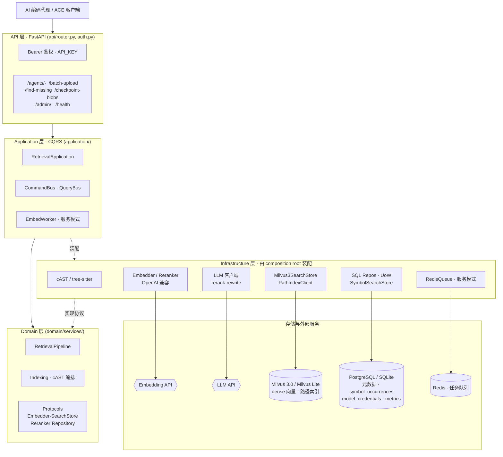
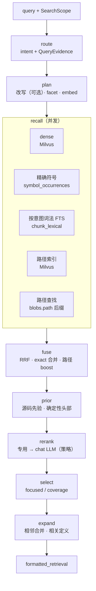

<div align="center">


# OpenContextEngine

**自托管、ACE 兼容的代码检索服务，为 AI 编码代理提供精准上下文。**

dense + exact + path 混合召回 · cAST 语义切块 · 按需重排 · 任务感知选择

[English](README.md) · [简体中文](README.zh-CN.md)

[](https://github.com/JasonEX/oce/actions/workflows/ci.yml)
[](LICENSE)
[](https://github.com/JasonEX/oce/pkgs/container/oce)
[](https://fastapi.tiangolo.com/)
[](https://milvus.io/)
[](#api)

</div>

OpenContextEngine 是一个自托管、ACE 兼容的代码检索服务。它用 cAST 语义切块索引源码，
把元数据存入 PostgreSQL 或 SQLite，在 Milvus 3.0 中做 dense 向量检索，可选调用专用
rerank API 或 chat LLM 重排，再按任务类型选择上下文。

它提供两种部署模式：零依赖的**个人模式**（SQLite + 内嵌 Milvus Lite，后台 worker 关闭），
面向单机；以及**服务模式**（PostgreSQL + Milvus 3.0 + Redis），面向共享、更高吞吐的部署。

项目完全开源，服务端和客户端分别维护：

- 服务端：<https://github.com/JasonEX/oce>
- 客户端：<https://github.com/oce-ai/oce-client>

这是此前 ACE 服务的重构版本，相关背景和早期实现见
[linux.do 讨论](https://linux.do/t/topic/2308140/125)。

如果你只想在本机给 AI 编码工具提供代码上下文，直接使用个人模式即可；如果需要让多台
机器或多个用户共享同一套索引，再部署服务模式并配合 `opencontextengine-client`。

## 特性

- **混合检索** —— 并发的 dense 语义召回（Milvus 3.0）、exact 精确标识符查找（`symbol_occurrences`）与独立路径索引，用加权 rank fusion 融合。
- **cAST 语义切块** —— 基于 tree-sitter 沿语义边界切分源码，而非机械的行窗口。
- **可组合重排 + 任务感知选择** —— 专用 reranker 提供低延迟相关性排序，chat LLM 负责全局比较实现语义；二者可单独运行，也可级联。两种重排都保留输入候选集，裁剪只由显式召回过滤与最终 selector 执行。
- **两种部署模式** —— 零依赖个人模式（SQLite + 内嵌 Milvus Lite）面向单机；服务模式（PostgreSQL + Milvus 3.0 + Redis）面向共享与更高吞吐。
- **ACE 兼容 API** —— 面向 ACE 客户端的 `/agents/*` 接口，Bearer 鉴权保护。
- **清晰的 DDD/CQRS 架构** —— 依赖向内收敛；infrastructure 只由 composition root 装配，业务逻辑保持可测。
- **运维 admin API + 监控** —— 独立 admin key 的接口面管理模型凭据、嵌入队列与垃圾回收；旁路 metrics 管线记录调用/token/资源指标与检索各阶段审计。
- **[黑盒检索评测体系](benchmarks/README.md)** —— 只通过发布版 client 与稳定 API 驱动服务，覆盖英中双语短查询、Python/TypeScript/Rust 人工复核的架构查询，以及固定版本的 SWE-bench/SWE-Explore issue 评测，不导入服务端实现，也不直读数据库。

<details>
<summary><strong>目录</strong></summary>

- [特性](#特性)
- [环境要求](#环境要求)
- [个人模式](#个人模式)
- [服务模式](#服务模式)
- [客户端与 MCP](#客户端与-mcp)
- [API](#api)
- [架构](#架构)
  - [检索管线](#检索管线)
- [测试](#测试)
- [许可](#许可)

</details>

## 环境要求

- Python 3.11 及以上
- [uv](https://docs.astral.sh/uv/)

个人模式无需其它依赖：元数据落在 SQLite，向量落在内嵌的 Milvus Lite 文件。服务模式额外
需要 PostgreSQL 16、Milvus 3.0 和 Redis；其开发用编排见 `docker-compose.dev.yml`。

## 个人模式

个人模式适合本机使用，不需要单独部署 PostgreSQL、Milvus 或 Redis。安装 CLI、生成配置、
填好嵌入 key，然后启动：

```powershell
uv tool install "git+https://github.com/JasonEX/oce.git"
oce init                    # 生成 ~/.oce/data/.env
```

本 fork 不发布 PyPI。正式版本请使用带版本号的 GHCR 镜像；也可以像上面一样直接从 Git
源码安装当前版本。

编辑 `~/.oce/data/.env`。嵌入服务是建库和检索所需的唯一必填项；默认配置使用 SiliconFlow
和 Qwen3-Embedding-4B（输出 1024 维向量）：

```dotenv
EMBED_API_KEY=你的嵌入服务密钥
# 以下两项已有默认值，只有更换供应商或模型时才需要修改
EMBED_ENDPOINT=https://api.siliconflow.cn/v1/embeddings
EMBED_MODEL=Qwen/Qwen3-Embedding-4B
```

嵌入会把准入后的源码块发送到配置的 endpoint；可选重排和 LLM 功能还会发送检索 query 和候选源码
片段。私有代码只应使用获准接收这些数据的端点，优先选择本地或内网服务。

新生成的个人模式配置默认关闭可选重排，需要先选择运行方式和数据边界。
API provider 适合可预期的相关性排序：

```dotenv
RERANK_ENABLED=true
RERANK_PROVIDER=api
RERANK_API_KEY=你的 rerank 服务密钥
RERANK_ENDPOINT=https://provider.example.com/v1/rerank
RERANK_MODEL=Qwen/Qwen3-Reranker-0.6B
# 对默认 50 条候选窗完整排序；provider 未返回的候选仍保留
RERANK_TOP_N=50
# 限制对每个候选重复读取的 query 长度；保留 issue 开头的主要上下文
RERANK_MAX_QUERY_CHARS=2400
# adaptive 在 exact symbol / path 证据已回答问题时跳过调用
RETRIEVAL_RERANK_POLICY=adaptive
# Qwen 报告任务 instruction 通常有增益；provider 不支持时请置空
# RERANK_INSTRUCTION=Given a code search query, judge whether the code snippet implements, defines, or directly answers what the query asks for
```

强 chat LLM 可以替代专用 reranker，或在它之后继续判断跨语言语义、真实实现与转发代码、
多文件行为。质量优先的级联建议先把第二阶段限制为 20 个候选，再在自己的 workload 上测量：

```dotenv
LLM_RERANK_ENABLED=true
LLM_API_KEY=你的 LLM 服务密钥
LLM_BASE_URL=https://provider.example.com/v1
LLM_MODEL=deepseek-v4-flash
RETRIEVAL_LLM_RERANK_POLICY=adaptive
LLM_MAX_CANDIDATES=20
LLM_RERANK_TIMEOUT_SECONDS=15
```

`RERANK_ENABLED` 与 `LLM_RERANK_ENABLED` 授权各自的重排阶段；两个 `*_POLICY` 只决定已启用
模型看到哪些查询，且两种模型共用同一份确定性判断。API provider 和 chat LLM 会向各自 endpoint 外发数据，local provider 不外发。`adaptive` 在 exact symbol/path 证据
已足够时跳过模型调用，reference 查询不交给 chat LLM 以保留 occurrence 覆盖，而
feature/flow/overview/compound 查询两者都用。`always` 对所有至少两个候选的结果重排，
适合质量优先部署与受控对照。每次检索的路由（`dedicated`、`dedicated+llm` 或
`skip:<原因>`）记录在 `retrieval_metrics.rerank_route`。专用 reranker 有两种提供方式：
`RERANK_PROVIDER=api` 把 query 和候选源码发到远端 rerank 端点；`RERANK_PROVIDER=local` 在进程内跑
ONNX 交叉编码器（`uv sync --extra local-rerank`，`RERANK_LOCAL_MODEL_DIR` 指向含 `model_int8.onnx`
与 `tokenizer.json` 的目录，例如 `jinaai/jina-reranker-v2-base-multilingual` 的 onnx 导出），不外发任何
数据。该评测模型使用 [CC-BY-NC-4.0](https://huggingface.co/jinaai/jina-reranker-v2-base-multilingual)，部署前必须单独核对模型的使用权，或改用兼容的其他导出。实测的 16 核 CPU 上 20 个候选约 1.2 秒。同时启用两种后端时，管线按专用 reranker
→ chat LLM 级联。默认关闭只是运行成本和数据边界，不代表质量高低。当前 development
benchmark 中，本地 reranker 明显改善长 issue 排序，保持短结构查询 Top-1，但没有改善较小的
语义集。因此先把它作为复杂查询的可选增强；在更广泛的重复评测完成前不修改默认开关。详见
[benchmark 报告](benchmarks/results/nine-language-utility-2026-09-03.md)。无论窗口多大，
窗口外候选都不会被 reranker 删除，仍可进入最终选择。

然后启动服务：

```powershell
oce serve                   # http://127.0.0.1:8986
```

个人模式默认只监听 `127.0.0.1`，并预填客户端约定的 `API_KEY=sk-opencontextengine`。如果
要监听局域网或公网地址，请改用强随机 `API_KEY`，并在客户端同步设置 `OCE_API_KEY`。

`oce serve` 启动时会自动执行数据库迁移（Alembic），然后准备好 SQLite、内嵌 Milvus Lite
文件和一个关闭的后台 worker，因此 `oce init` 只暴露你真正要填的少量 key。生成的 `.env`
放在 data 目录，每次启动自动加载。常用参数：

- `--data-dir <path>` —— 数据库、向量文件和 `.env` 的存放位置（默认 `~/.oce/data`）
- `--env-file <path>` —— 改为加载指定的 `.env`（优先级最高）
- `--port <n>` / `--host <addr>` —— 监听地址（默认 `127.0.0.1:8986`）

`oce version`（或 `oce --version`）打印当前版本；`oce -v serve` 把日志级别提到 INFO，
`-vv` 提到 DEBUG（默认 WARNING，让检索管线的 info 日志保持安静）。

想临时试跑而不安装：
`uvx --from "git+https://github.com/JasonEX/oce.git" oce serve`。

## 服务模式

服务模式面向多人或多台机器共享索引，由 PostgreSQL、Milvus 3.0 和 Redis 支撑。推荐使用
仓库自带的 Docker Compose：

```powershell
git clone https://github.com/JasonEX/oce.git
Set-Location oce
Copy-Item .env.example .env
# 编辑 .env：至少设置 API_KEY、ADMIN_API_KEY、EMBED_API_KEY；按需设置 LLM_API_KEY
docker compose up -d
```

根目录的 `docker-compose.yml` 会一起启动 OCE、PostgreSQL、Redis 和 Milvus 依赖；只向宿主机
发布 OCE API，Milvus 保留在 Compose 内部网络。应用容器启动时自动执行迁移。服务模式务必
把 `API_KEY` 和 `ADMIN_API_KEY` 换成强随机值，并在 `.env`
中设置 Compose 使用的 `POSTGRES_PASSWORD`、`REDIS_PASSWORD`；不要把真实密钥提交到仓库。
开发环境若只想启动依赖、在宿主机运行应用，可使用 `docker-compose.dev.yml`，但要先把
`.env` 中的 `DB_URL`、`REDIS_URL` 改为该文件映射到宿主机的端口，再执行
`uv run alembic upgrade head` 和 `uv run uvicorn`。

也可以直接使用已经发布的镜像：

```powershell
docker pull ghcr.io/jasonex/oce:latest
```

在自己的 Compose、Kubernetes 或其它编排文件中，将应用服务镜像设为
`ghcr.io/jasonex/oce:latest`，并提供下面三个服务连接配置：`DB_URL`、`REDIS_URL` 和
`MILVUS_ENDPOINT`。镜像入口默认监听容器内的 `8986` 端口。

### Admin 管理面板

服务启动后可使用官方在线面板：<https://oce-ai.github.io/oce-admin>。

1. 在服务端设置独立的 `ADMIN_API_KEY`（不设置时会回落到 `API_KEY`）。
2. 在面板中填写服务地址和 admin key。
3. 通过面板管理模型凭据、队列、垃圾回收和监控指标。

admin key 只保存在浏览器本地存储中，不要写入 URL、仓库或日志。自定义面板域名时，用
`CORS_ORIGINS` 配置允许的来源。

模型客户端从单张 `model_credentials` 表按 `kind`（`embed`、`rerank`、`llm_rerank`、
`query_rewrite`）解析凭据：取 status=active 中 `priority` 数字最小的一行。某个
kind 没有匹配的启用行时，对应客户端回退到各自的环境变量（`EMBED_*`、`RERANK_*`、`LLM_*`；
重排还会复用嵌入 key）。通过 `/admin/credentials` API 管理这些行，再调
`POST /admin/credentials/reload` 可在不重启服务的情况下热重载运行凭据。嵌入 API key、凭据
超时和凭据批量限制可原位更新；更换嵌入 endpoint、模型、维度或文档输入窗口前，必须准备
干净的元数据与向量存储，再让客户端完整重同步；不兼容的热重载会被拒绝。

空索引第一次使用时，OCE 会持久化一份不含密钥的 SHA-256 profile，覆盖解析后的 embedding
endpoint 哈希、模型、维度、query instruction 哈希、文档窗口，以及 chunker 模式/配置/版本、
Milvus endpoint/collection 标识、path index 模式、dense metric、索引 schema、symbol
extraction 和 path-document 版本。每次启动都会在 worker 运行前将当前配置与该 profile
比对。配置不匹配，或旧索引已有数据却没有 profile 时，服务会 fail closed，且不会改动旧
数据。此时应改用新的 data directory（服务模式则使用新的数据库和 Milvus collection
名称），再让客户端完整重同步。OCE 不会再把旧向量与新模型静默混用、让 ready 元数据连接
到另一套向量 collection，也不会在切块行为变化后继续复用旧 chunks。

SiliconFlow 单次嵌入请求的 `input` 数组最多接受 32,000 字符。`max_batch_size` 和
`max_batch_chars` 是每个凭据可覆盖的 provider 默认值。超过 `max_input_chars` 的输入会在
文本边界带重叠地切分、分别嵌入，再按长度加权、池化并归一化成一个 chunk 向量。这种模型
特定的分段不会改变领域层的 chunk 边界。

包含多个明确句子或列表项的仓库级请求，会被分解成一个完整查询加若干有界 facet 查询。每个
查询独立召回候选；结果用加权 rank fusion（`RETRIEVAL_RRF_K` 可调）融合后再重排。单查询
模式用 `RETRIEVAL_DEFAULT_TOP_K`，多查询模式每个查询用 `RETRIEVAL_PER_QUERY_TOP_K` 控制
候选池大小。静态 source prior 和可选召回置信度下限都在模型之前应用，避免用不同
量纲的模型分数和召回分数混合过滤，也不会再覆盖模型顺序。两种 reranker 都只提升
队首候选，并保留其余顺序给最终 selector。`adaptive` chat-LLM 策略在 exact symbol/path 证据
足够时跳过模型，reference 查询保留 occurrence 覆盖，feature/flow/overview/compound 查询则进行
全局片段语义比较。最终选择对 symbol/path
查询使用 focused 模式，按相关性顺序允许同文件提供更多片段；其他查询使用 coverage 模式，先
覆盖不同文件再填充剩余预算。两种模式都抑制文件内重叠片段；focused 使用 12K 字符预算，
coverage 保留 32K 仓库探索预算。设
`RETRIEVAL_QUERY_DECOMPOSITION_ENABLED=false` 可关闭分解，回到经典单查询召回。

精确标识符召回直接关联 checkpoint 成员关系，大型工作集不会关闭 exact recall，也不会把全部
成员展开为一个 SQL `IN (...)`。仅 added 组成的 scope 与异常大的请求增量会使用固定批次查询；
超时仍回退 dense 检索。
symbol index 由 tree-sitter 对整文件抽取 definition、endpoint、import 与调用点，并保留真实
行号；无法加载 grammar 时回退 regex。调用点让 reference 和调用链查询拿到精确的使用证据，
但这仍不是解析过的调用图：被调名没有绑定到接收者类型或具体实现。query embedding 最多取请求的前 `EMBED_MAX_QUERY_CHARS`（3,000）个
字符；issue 长文超出的部分只会稀释向量并拖慢调用。SQLite 个人模式用 FTS5、PostgreSQL 服务模式用 `tsvector` 建立词法索引，
补充召回 dense 不敏感的报错文案、日志文本与调用点。词法召回用于 reference、调用链、feature、
overview 和复合查询；symbol/path 只在确定性证据缺失时补跑，引号或报错短语会强制启用。
标识符同时按整体和子词入库，因此
`ParseConfig`、`parse_config` 和自然语言里的 “parse the config” 可以相互命中。请求中的
traceback 帧会变成精确路径与函数证据，引号内报错会变成短语查询。exact symbol 未命中时，
词法回退只查标识符整体代理 token，不用宽泛高频子词。reference 查询会以该代理 token 作为
词法召回的必要条件：片段必须包含完整标识符才能进入这一路，排序仍由全部词元决定。cAST chunk 的 embedding
输入会带封闭作用域链（如 `class Foo > def bar`），结果中也会显示同一条 `Context:`。精确
symbol 定义和 SQL 精确路径命中会占用有界头部槽位，不再与 RRF 分数直接混排。路径先验把文档目录
（`docs/`、`doc/`、`examples/`、changelog）、变更记录、配置文件、`.pyi` 桩、`__init__.py`
桶文件和测试文件视为实现文件之后的辅助材料，仓库根目录的 `README` 保持全权重。feature、
compound、调用链和 reference 查询会给未被路径先验降权的实现文件保留前几个槽位（根目录
`README` 在这条规则里仍按文档处理）：同时领先
dense 和词法列表的测试或文档片段，其融合分数是乘性先验压不下去的；明确问测试的查询保持
中立先验。reference 查询只提升 exact 或整标识符词法证据，并把被问符号自身的声明排在最先
出现的使用位置之后。这两条头部规则在模型重排之后会再应用一次，层内保持模型给出的顺序；
专用 reranker 最多只收到
`RERANK_MAX_QUERY_CHARS` 个字符的请求文本，issue 长文不再成倍放大它的延迟。exact、
路径查找和按意图的词法召回在 query embedding 往返之前就开始执行。选择后，同文件相邻
片段会合并；调用链、feature 和 overview 查询可用主结果的剩余字符预算附带简短定义摘录，
compound 查询不会对已选片段里的所有标识符扇出。请求刚加入的少量 `added_blobs` 还会获得轻量
工作集先验。

可复现消融可通过 `CHUNKING_SEMANTIC_ENABLED`、`RETRIEVAL_EXACT_ENABLED`、
`RETRIEVAL_LEXICAL_ENABLED`、`RETRIEVAL_PATH_LOOKUP_ENABLED`、
`RETRIEVAL_SOURCE_PRIORITY_ENABLED`、`RETRIEVAL_COVERAGE_SELECTION_ENABLED`、
`RETRIEVAL_MERGE_ADJACENT_ENABLED` 与 `RETRIEVAL_RELATED_DEFINITIONS_ENABLED` 分别关闭
结构化切块、exact recall、词法召回、路径查找、源码路径先验、coverage selector、相邻合并和
相关定义扩展。切块配置变化后必须使用干净数据目录完整重同步，这些开关不会改写已有索引。

上传准入会在切块前拒绝依赖/构建/缓存目录、`.env`、私钥、SSH/AWS 凭据目录、含 NUL 的文件，
以及 SVG、媒体、压缩包、压缩打包产物、source map、lock 文件等非源码产物；`.env.example`
等安全模板仍可索引。被跳过的路径会作为空的 ready blob 持久化，避免客户端反复重传。
项目清单和测试固件有显式豁免。

## 客户端与 MCP

客户端负责扫描本地工作区、上传变更、维护 checkpoint，并调用服务端检索当前代码。它是
独立发布的包，详见 <https://github.com/oce-ai/oce-client>：

```powershell
uv tool install opencontextengine-client

$env:OCE_API_URL = "http://127.0.0.1:8986"
$env:OCE_API_KEY = "sk-opencontextengine"  # 服务模式请改为服务端 API_KEY
$env:OCE_WORKSPACE = (Get-Location).Path

oce-client sync
oce-client retrieve "Where is request authentication implemented?"
```

需要接入支持 MCP 的 AI 编码工具时，安装 MCP extra 并启动 stdio server：

```powershell
uv tool install "opencontextengine-client[mcp]"
oce-client-mcp --workspace C:\path\to\workspace
```

`oce-client-mcp` 会在后台建立初始索引、监听工作区变化，并把 `codebase-retrieval` 暴露为
MCP 工具。多个工作区可重复传入 `--workspace`；此时工具调用必须指定对应的
`workspace_folder`。API 地址、密钥和工作区也可以通过 `OCE_API_URL`、`OCE_API_KEY`、
`OCE_WORKSPACE`/`OCE_WORKSPACES` 配置。请将密钥放在环境变量或 secret manager 中，不要写进
MCP 配置文件。

## API

鉴权分三档：

- **公开**（无需鉴权）—— `GET /health`、`GET /version`
- **数据面** —— `Authorization: Bearer <API_KEY>`
- **Admin**（`/admin/*`）—— `Authorization: Bearer <ADMIN_API_KEY>`；未配置 `ADMIN_API_KEY` 时回落到 `API_KEY`

后端默认已放行官方 `oce-admin` 面板 `https://oce-ai.github.io`，直接使用公共面板时无需额外配置。
若面板部署在自定义域名或私有地址，用 `CORS_ORIGINS` 覆盖（多个来源用逗号分隔）；设
`CORS_ORIGINS=`（留空）可关闭浏览器跨域调用。admin key 仅保存在面板浏览器的本地存储中，不要写入仓库或 URL。

### 数据面端点

| 方法 | 路径 | 用途 |
| --- | --- | --- |
| `POST` | `/find-missing` | 分类未知和未索引的 blob 哈希 |
| `POST` | `/batch-upload` | 切块、嵌入并索引源码 blob |
| `POST` | `/agents/codebase-retrieval` | 返回格式化的代码上下文 |
| `POST` | `/agents/blob-status` | 校对 blob 与 checkpoint 状态 |
| `POST` | `/checkpoint-blobs` | 创建或推进工作集 checkpoint |

### Admin 端点

| 方法 | 路径 | 用途 |
| --- | --- | --- |
| `GET` | `/admin/credentials` | 列出模型凭据（密钥已脱敏） |
| `POST` | `/admin/credentials` | 创建凭据 |
| `PATCH` | `/admin/credentials/{id}` | 更新凭据 |
| `DELETE` | `/admin/credentials/{id}` | 删除凭据 |
| `POST` | `/admin/credentials/{id}/duplicate` | 用新 key 复制一份凭据 |
| `POST` | `/admin/credentials/reload` | 热重载启用中的凭据 |
| `GET` | `/admin/queue` | 嵌入队列深度与在飞数 |
| `POST` | `/admin/queue/reset` | 清空或重置嵌入队列 |
| `POST` | `/admin/queue/requeue-stale` | 重新入队滞留的在飞 blob |
| `POST` | `/admin/gc` | 回收过期的 chain 与 blob |
| `GET` | `/admin/stats` | 调用 / token / 检索 / 资源指标 |
| `GET` | `/admin/index-stats` | 元数据、dense/path/cache、运行开关与持久化 index profile |

示例：

```powershell
$headers = @{ Authorization = "Bearer $env:API_KEY" }
$body = @{
  information_request = "Where is request authentication implemented?"
  # 全库检索已禁用：必须声明工作集（有效的 checkpoint_id 或非空 added_blobs）。
  # added_blobs 是 batch-upload 返回的 blob_name（sha256 内容地址），此处为示例占位。
  blobs = @{ checkpoint_id = ""; added_blobs = @("<blob-name-from-batch-upload>"); deleted_blobs = @() }
} | ConvertTo-Json -Depth 4
Invoke-RestMethod http://127.0.0.1:8986/agents/codebase-retrieval `
  -Method Post -Headers $headers -ContentType application/json -Body $body
```

## 架构

依赖方向向内收敛（`shared <- domain <- application <- api`）。`infrastructure` 实现
domain/shared 协议，且只能由 composition root（`application/container.py`）装配；router
不编排业务流程。



应用层负责用例编排和事务边界。FastAPI 只校验传输 DTO、执行鉴权和错误映射。PostgreSQL
（个人模式下为 SQLite）存 blob/chunk/checkpoint 元数据和标识符出现位置；Milvus 存 dense
向量和路径索引。

### 检索管线

`RetrievalPipeline.search`（`domain/services/retrieval.py`）是 `RetrievalState` 上的一条固定
状态转移序列：每个阶段只读写属于自己的字段，任何可选算子关闭后都退化为恒等变换。

| 阶段 | 职责 |
| --- | --- |
| route | 确定性意图，加上 `QueryEvidence`：标识符、traceback 帧、引号内报错文案、文件名、词法词元 |
| plan | 可选 LLM 改写、句子级 facet 分解、查询向量 |
| recall | dense（Milvus）∥ 精确符号（SQL）∥ 按意图词法 FTS（SQL）∥ 路径索引（Milvus）∥ 精确路径查找（SQL） |
| fuse | dense facet 与词法结果按加权 RRF 融合，合并 exact 命中，路径 boost / 回填 |
| prior | 源码先验 × 工作集先验；有界头部槽位：精确 symbol/path 答案、语义查询的未降权源码文件、reference 查询里排在声明之前的使用位置 |
| rerank | `plan_rerank` 决策 → 专用 reranker → chat-LLM reranker，两者都保留候选集 |
| select | focused / coverage 选择，字符预算为硬限制 |
| expand | 合并同文件相邻片段；语义关系查询可用剩余上下文预算附带相关定义 |



## 测试

按文件独立运行，让 Milvus Lite 和 tree-sitter 运行时在进程间释放：

```powershell
uv run pytest tests/unit/application/test_service.py -q
uv run pytest tests/unit/domain/test_retrieval.py -q
uv run pytest tests/unit/infrastructure/test_milvus3.py -q
```

在内存受限的开发机上，不要在一个进程里运行整个 `tests/unit/infrastructure` 目录。

## 许可

Apache-2.0。OpenContextEngine 与 Augment Code Inc. 相互独立。
