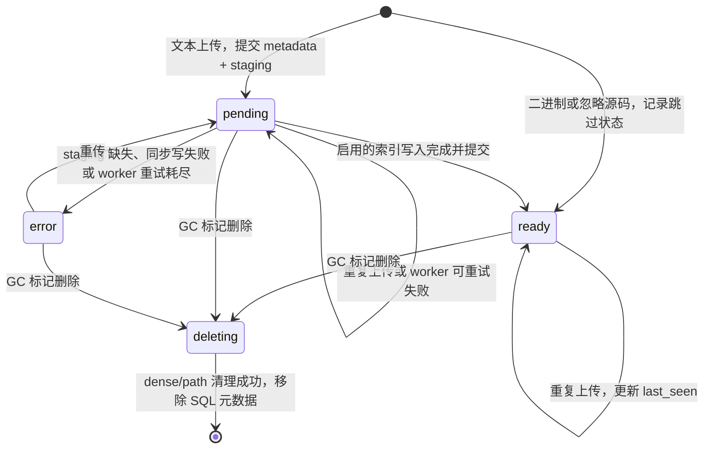
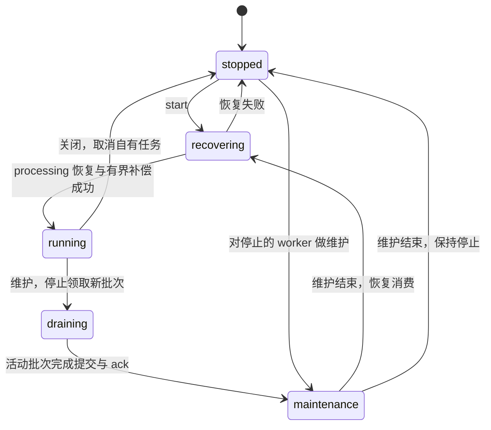

# 运行时所有权与状态转移

`application/container.py` 是进程内的组合根，`build_*` 构建子系统，
`Container.start()` / `close()` 管理它装配的资源。`RetrievalApplication` 编排用例，
`ApplicationCommands` / `ApplicationQueries` 绑定 handler；router 只处理 DTO、鉴权与异常映射。

## 启动、关闭与就绪

启动顺序为索引 profile 校验 → worker → 监控采集 → 有界存储预热。预热通过仓储接口最多
取 256 个 READY blob，依次探测 dense、已启用的 path 与 lexical；采样和每项探测各有
10 秒上限。失败记录日志并保留冷状态，不阻止启动，也不保证首个请求的所有车道都已就绪。

关闭先停止 worker，再停止资源采样、指标清理与 metrics，随后关闭 dense/path store、
模型客户端和 Redis 连接池。ASGI lifespan 调用这两个方法，最后清除容器缓存并释放共享
SQL engine，不另行编排 worker 或模型资源。

`index_profiles` 保存不含密钥的 embedding、切块与 schema fingerprint。
`IndexLifecycleManager.current` 是进程内已验证 profile 的依据；它尚未建立时，上传与
checkpoint 返回 `SERVICE_NOT_READY` / HTTP 503，不先写入无 fingerprint 的元数据。

| 条件 | 行为 |
| --- | --- |
| embedding 已启用，但没有可解析凭据或维度不匹配 | 暂缓校验；运维接口仍可服务，worker 保持停止，不消耗 PENDING 重试次数 |
| profile 校验通过 | 启动已装配的 worker；index-stats 的 profile 为 `compatible` |
| 已有数据没有 fingerprint，或持久 profile 不兼容 | 启动中止；已有数据保持原样，需新数据目录或清理 SQL/向量存储后完整重同步 |
| `EMBED_ENABLED=false` | 校验 disabled profile，不解析 embedding 凭据；仍可切块，文本保留 PENDING 与 staging，不写 dense/path 向量 |

profile 校验不探测远程密钥或端点是否可用；`/health` 也只表示进程存活。embedding 开关
同样进入 fingerprint，不能切换开关后直接复用另一模式的旧索引。worker 仅在
`WORKER_ENABLED=true` 时装配；无 worker 时，上传和检索的 `added_blobs` 用例同步索引。

## 凭据热重载

凭据 CRUD 只修改 `model_credentials`；`POST /admin/credentials/reload` 更新已装配的客户端，
不重读 env 文件，也不改变启动时的阶段开关或本地 ONNX 配置。凭据按 kind、active 状态和
最小 priority 解析，同 priority 按最小 id；缺少可用记录时回落对应环境配置。

整次重载由一把锁串行化：先准备 embedding 与已启用的 API reranker，再验证 embedding
profile，通过后激活 embedding 并清空 query cache，再激活 reranker，最后更新已启用的
LLM 客户端并尝试启动尚未运行的 worker。准备或 profile 校验失败时丢弃候选；不兼容
embedding 不替换旧 runtime。
`EMBED_ENABLED=false` 只校验 disabled profile，跳过 embedding 的准备、激活与 cache 清理，
其他已启用客户端仍可更新。旧 delegate 在其活动调用结束后关闭。

| 结果 | HTTP 200 响应 |
| --- | --- |
| 全部更新成功 | `reloaded=true`，`reason=null` |
| 凭据或 profile 导致 `ServiceNotReadyError` | `reloaded=false`，`reason` 说明拒绝原因 |
| 某个 LLM 客户端更新失败 | 继续更新其余客户端；`reloaded=false`，`reason` 列出失败 kind 与异常类型，已更新客户端不回滚 |

其他未处理异常沿用 HTTP 错误路径。请求串行不等于模型图事务性切换：客户端依次激活，
LLM 失败可留下部分更新；运维方应检查响应，而非仅检查 HTTP 状态。

## 索引任务与短事务

数据库的 blob 状态和 staging 是持久任务来源；Redis 是投递队列。上传先提交 metadata
与 staging，再尝试入队，两者没有分布式事务。重复上传 PENDING/READY 只用单列 SQL
更新 `last_seen`，不保存上传方的旧状态。

同步用例与 worker 共用 `_index_pending_batch`，远端 embedding 不持有元数据事务：

1. `prepare` 在短事务内锁定 PENDING 行、刷新 `last_seen`，写入切块、符号与词法投影后提交。
   SQLite 忽略 `FOR UPDATE`，因此取得写锁后重新读取 PENDING 行。
2. `write_vectors` 在事务外调用 embedding，写入 dense 和已启用的 path 索引。
3. `complete` 用新短事务标记 chunk 已嵌入，将仍为 PENDING 的 blob 标记 READY 并删除 staging。

READY 对需要索引的文本表示所有启用的索引已完成；空文件或没有可切内容的文件也需完成
适用的路径索引。关闭 embedding 时 `complete` 不改变状态。并发处理或跨存储失败可重复
幂等 upsert，不能提前宣称 READY。

同步向量写失败由 `fail` 将仍为 PENDING 的成员标记 ERROR 并保留 staging。worker 批次
失败则逐个隔离重试，仅对仍为 PENDING 的 blob 计数；耗尽重试时提交 ERROR 并删除 staging。
`complete` / `fail` 重新读取状态，worker 失败回调也检查 PENDING，不复活已完成或正在删除
的成员。成功提交后才 ack；失败先提交 retry/error，再释放 sentinel 并按需要入队。ack
失败只记录日志，不把已完成索引改为失败。

## worker、队列与维护

worker 的生命周期锁串行化启动、停止和维护，`WorkerState` 显式约束状态转移：

维护不取消正在写索引的批次；调用方取消时也先排空，再恢复 worker。阻塞 dequeue 在暂停
后返回但尚未处理的投递留在 processing，恢复时重新投递。正常关闭可取消活动批次，留待
下次启动恢复。真实 GC 和队列 reset 复用维护上下文，dry run 不暂停 worker。

Redis 主列表保存待领取投递，processing 保存已领取未 ack 投递，sentinel 集合覆盖两者。
enqueue 去重、ack/fail、processing 恢复和 retain 各自通过 Lua 原子更新列表与 sentinel；
维护期间上传方仍可入队。队列与 worker 同时装配、关闭；同一队列的维护由一个服务进程
拥有，不支持跨进程消费租约。

启动先恢复 processing，再补偿 PENDING。每次补偿最多 4 页、每页 100 个名称，使用
`(status, blob_name)` 索引和 keyset 游标，不读取源码；一页全部入队后才前移，末尾回绕。
启动只处理首批，之后每 30 秒续扫，普通上传仍立即入队。

批次先阻塞领取一条，再非阻塞补齐；补齐异常仍把已确认名称交给 worker。若 Redis 已搬移
投递但响应丢失，或 ack 失败，需重启或队列维护恢复 processing。周期补偿受 sentinel
去重约束，不抢回 processing；`requeue-stale` 也不能替代 processing 恢复。

`GET /admin/queue` 用 LLEN 读取 `main_size`、SCARD 读取 `inflight`、SQL COUNT 读取
`db_pending`，不拉取名单。`inflight` 包含主列表和 processing，不能当作活动批次数；
这些计数不是跨存储原子快照。无 worker 时返回 `enabled=false`、计数 0 和
`worker_state=disabled`，零值不表示数据库没有 PENDING。

reset 默认 `mode=sync`，保留数据库仍 PENDING 的投递并补入缺失任务；`mode=purge` 先清空
队列再补入。`requeue=false` 只控制本次立即补入，不停止后续周期补偿。reset 是显式维护
操作，会读取 PENDING 名单；`requeued` 是本次尝试补入的数量，并发入队仍由 Redis 去重。

## GC 与持久删除

`POST /admin/gc` 默认 dry run、TTL 30 天、blob 扫描上限 1000；HTTP 请求要求 TTL 至少
1 天。真实删除先排空 worker，扫描过期 checkpoint 与未被引用的 blob，并排除队列
inflight 身份。本次删除 checkpoint 后新失去引用的 blob 等下次 GC；删除 checkpoint
不直接删除源码。

删除先用短事务重新检查 TTL 和 checkpoint 引用并标记 DELETING，随后在事务外删除
dense/path，均成功后再用短事务移除仍为 DELETING 的 SQL 元数据。任一存储失败保留删除
身份；后续 GC 优先重试 DELETING，不再等待 TTL。重试依赖再次调用 GC，没有独立 outbox
或删除后台任务。同步 `prepare` 刷新 `last_seen`，避免旧过期名单删除刚开始索引的文件。

checkpoint 在更新成员 `last_seen` 的 SQL 写边界拒绝 DELETING 并回滚整个事务；PENDING
和尚未上传的身份仍可加入。上传相同 DELETING 身份返回 `SERVICE_NOT_READY` / HTTP 503，
删除完成后可重新上传；旧 aggregate 保存也不能覆盖 DELETING。index-stats 的
`blobs_deleting` 展示待清理身份数量。

## 检索范围与 SQL 存储

工作集为 `(checkpoint 成员 ∪ added_blobs) − deleted_blobs`。scope 解析只读取 READY
身份，把当时尚未就绪的声明成员保留为排除项，避免 SQL checkpoint 子查询因它们随后
变成 READY 而扩大本次范围。dense/path 的残留写入不能绕过 READY 准入；SQL 精确、词法
与路径查找共用 `scope_filter.py` 的范围规则。

checkpoint 可包含未就绪身份，建立 checkpoint 不代表其成员可检索。空工作集返回空结果；
没有 checkpoint 或 added 声明则拒绝请求，不回落全索引。检索的 `deleted_blobs` 只缩小
本次范围，物理删除由 GC 负责。

SQLite 每个连接启用外键、WAL 和 5 秒 busy timeout。迁移清理历史孤儿元数据并维护补偿
扫描所需索引；服务模式执行 `uv run alembic upgrade head`，个人模式由 `uv run oce serve`
自动迁移。短事务避免在 embedding 往返期间占用写锁，但不使 SQLite 支持多个同时写者。

HTTP API 将新上传路径限制为 1024 个字符，SQL path 列声明同一长度；SQLite 不强制
VARCHAR 长度，领域对象仍能读取历史长路径记录。path embedding 使用完整路径文档，
Milvus 的 path/path_document 只存 UTF-8 有界诊断前缀；实际返回路径来自 SQL occurrence，
旧 collection 无需因字段收窄而重嵌入。

## embedding 请求与 query cache

`CredentialConfiguredEmbedder` 把同一 semaphore 传给所有新旧 delegate，限制文档和查询
HTTP 批次，热重载不叠加并发额度；直接构造的 `OpenAIEmbedder` 自行持有 semaphore。

query cache 是只存 query 哈希和向量的进程内 TTL LRU。启用时，同一哈希与 generation
共用活动任务；活动任务总数受 cache 容量约束，满时等待槽位，每个调用方取得独立向量
副本。决定性 SQL 提前返回或调用方取消，只通过 `wait_released` 释放等待者，provider
继续完成，共享任务所有者消费结果或异常；请求等待路径不用 `asyncio.shield`。

清空 cache 同时递增 generation，新查询不加入旧任务，旧结果不回写新 cache。关闭时先
排空活动 query cache 任务，再关闭 delegate。源码向量和检索结果不缓存。检索阶段、请求
内证据、关系展开与预算规则见 [检索管线设计](retrieval-pipeline.md)。
