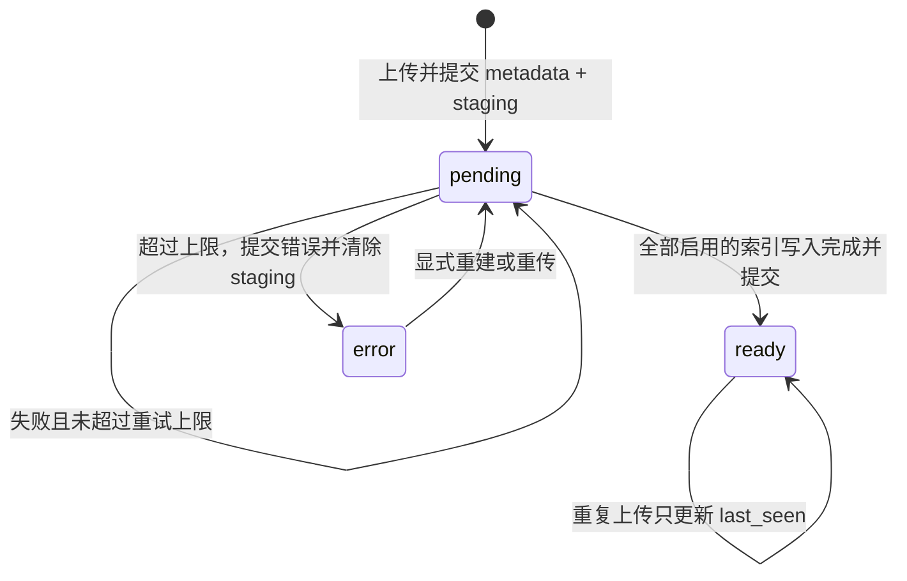
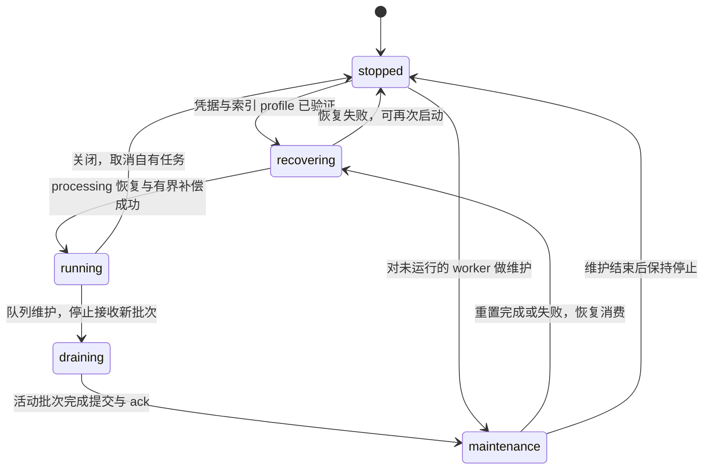

# 运行时所有权与状态转移

系统用现有应用用例、事务与 worker 管理生命周期。`application/container.py` 负责装配，
并拥有它装配出的全部资源：`Container.start()` 按依赖顺序启动（索引 profile 校验 → worker
→ 监控采集 → 有界存储预热），`Container.close()` 按相反顺序释放；ASGI lifespan 只调用这
两个方法。router 只转换 DTO、鉴权与映射异常；`ApplicationCommands` / `ApplicationQueries` 显式
绑定 handler，保留读写用例边界，缺少依赖或返回类型不匹配由类型检查暴露。

## 索引任务

数据库的 blob 状态和 staging 是持久任务来源；Redis 是投递队列。两者没有分布式事务，
因此先提交数据库，再尝试入队。worker 启动与周期补偿负责修复提交后丢失的投递。

更新 `last_seen` 使用单列 SQL 更新，不能把上传方读取到的旧状态覆盖回数据库。
`ready` 提交后才 ack；失败先提交 retry/error 状态，再释放 processing sentinel，决定是否
重新入队。向量按内容地址幂等写入；跨存储失败可能重复 upsert，但不能提前宣称 ready。

每次补偿最多取 4 页，每页 100 个名称，使用 `(status, blob_name)` 索引和 keyset 游标，
不读取源码或扫描全量待处理任务。游标由 worker 持有，周期续扫，到末尾回绕；一页完全
入队后才前移。启动只补偿第一批，剩余积压随后处理。普通上传仍立即入队。

## worker 与维护

worker 的一把生命周期锁串行化启动、停止和队列维护；不依赖 router 操作任务列表。
状态是代码里的显式枚举 `WorkerState`（`application/worker.py`），非法转移直接报错；
`/admin/queue` 的 `worker_state` 返回当前状态（无 worker 时为 `disabled`）。

维护不取消正在写索引的批次。维护请求取消时，也先等待排空，再恢复 worker；刚从阻塞
dequeue 返回但尚未开始的投递留在 processing，恢复时重新投递。正常进程关闭可取消
批次，processing 留待下一次启动恢复。

enqueue、ack/fail、processing 恢复和 retain 在 Redis 内原子变更列表与 sentinel；维护时
上传方仍可入队。队列与 worker 同生同灭（只在 `WORKER_ENABLED` 时装配），队列 reset 一律在
worker 的维护上下文里执行，不存在「worker 运行中拒绝 reset」的分支；`requeue=False` 只表示本次立即
清理，不暂停持久 pending 的周期补偿。多进程同时消费同一队列的租约不在此生命周期
协议内，部署时由单个服务进程拥有队列维护。

启动缺少有效 embedding 凭据时，运维接口仍可服务，worker 不消费 pending，不消耗重试。
上传与 checkpoint 在 profile 验证前返回既有的 `SERVICE_NOT_READY` / HTTP 503；不能先
写入无 fingerprint 的元数据，否则补齐凭据后也会被旧索引保护拒绝。就绪检查复用
`IndexLifecycleManager.current`，不增加独立 ready 标志。
成功热重载先验证 profile、激活 runtime 并清空 query cache，再启动尚未运行的 worker；
不兼容配置保持 fail closed。
`EMBED_ENABLED=false` 保留只切块、不写向量的行为；在这一显式模式下 profile 验证成功后
worker 仍可运行，blob 保留 pending 与 staging，不能把关闭 embedding 当作缺少凭据。

## embedding 请求

`CredentialConfiguredEmbedder` 持有一把 semaphore，传给所有新旧 delegate，管理文档和
查询 HTTP 批次；热重载不会让新旧凭据代际叠加并发额度。直接构造的 `OpenAIEmbedder`
自行持有 semaphore。旧请求完成后才关闭旧客户端。

query cache 只保存 query 哈希和向量。相同哈希、相同 generation 的活动请求共用任务；
活动任务数量沿用 cache 容量上限，满时等待已有任务释放槽位，不创建无界任务。每个调用方
取得独立的向量副本。检索 SQL 提前给出答案或某个调用方取消时，只释放等待者，provider
请求继续完成，结果或异常由共享任务收尾。「只释放、不取消」统一由 `shared/aio.py` 的
`wait_released` 实现，不用 `asyncio.shield`：Python 3.14 起 shield 会把等待者离开后任务
抛出的异常当作未处理错误上报，即使任务的所有者已经消费了它。

清空 cache 同时递增 generation；新查询不能加入旧 generation 的任务，旧结果也不能
写回新 cache。关闭时排空活动 query 任务，再关闭 delegate。源码向量与检索结果不缓存。

## 检索请求

检索阶段和排序策略见 [检索管线设计](retrieval-pipeline.md)。`RetrievalState` 只活到本次
请求结束；头部复位和关系裁尾复用原始证据，重新计算最终排序、来源和预算。SQL 车道仍
先于 embedding 往返启动，决定性证据不等待向量，车道失败仍写检索审计。

本轮改动不增加问法、文件名、项目名或 benchmark case 规则，也不更改 embedding 输入、
切块、符号抽取和 index-profile 语义版本。SQL 复合索引通过 Alembic 迁移替换旧 status
索引；服务模式执行 `uv run alembic upgrade head`，个人模式由 `oce serve` 自动迁移。
